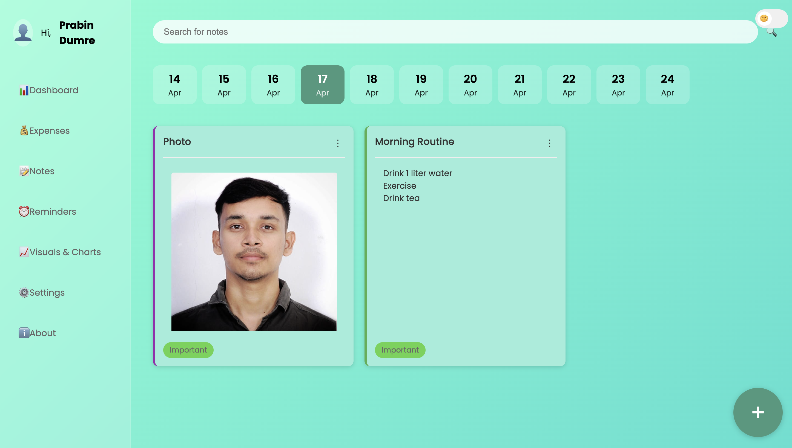

# FinNote - Personal Finance Management Application

## 🌟 Overview
FinNote is a modern, feature-rich personal finance management application that helps users track expenses, manage budgets, and organize financial notes. Built with HTML, CSS, and JavaScript, it offers a seamless experience for managing personal finances with an intuitive user interface.

## 🚀 Live Demo
Visit [FinNote](https://finnote.vercel.app/) to try the application.
## 🔍 Demo Purpose
This is a demo version of the FinNote application, intended for users to explore and understand the core functionality and interface of the project. If you're interested in using this application in production, contributing to its development, or integrating it into your own work, please reach out to the developers.

## 📸 Screenshots

### Authentication & User Management

*Secure login with email and password authentication*


*User registration with email verification*


*Secure password reset functionality*

### Core Features

*Comprehensive dashboard showing financial overview and quick actions*


*Detailed expense tracking and categorization*


*Financial notes and to-do lists management*


*Smart reminder system with email notifications*


*Interactive charts and financial analytics*


*User profile and application settings*

## 💡 Key Features

### 💰 Expense Management
- **Transaction Tracking**: Record and manage income, expenses, and transfers
- **Category-based Organization**: Organize expenses into categories (Food, Transportation, Entertainment, etc.)
- **Recent Transactions**: View 3 most recent transactions for quick access
- **Budget Overview**: Track remaining balance and budget status
- **PDF Export**: Generate detailed transaction reports
- **Search & Filter**: Find specific transactions quickly

### 📝 Notes & Reminders
- **Financial Notes**: Create, edit, and organize financial notes
- **To-Do Lists**: Manage financial tasks and goals
- **Smart Reminders**: Set payment reminders with email notifications
  - Immediate notification
  - 1-day advance notice
  - Due date reminder
- **Priority Levels**: Mark tasks by importance

### 📊 Analytics & Visualization
- **Interactive Charts**: Visual representation of expenses and budgets using Chart.js
- **Category Analysis**: Break down expenses by category with pie charts
- **Transaction History**: Detailed view of all financial activities
- **Budget vs Actual**: Compare planned vs actual expenses
- **Monthly Trends**: Track spending patterns over time

### ⚙️ User Features
- **Secure Authentication**: Email verification with OTP
- **Profile Management**: Update username, email, and password
- **Email Notifications**: Automated alerts for reminders and updates
- **Responsive Design**: Seamless experience across all devices
- **Dark/Light Mode**: Toggle between themes

## 🛠️ Technical Stack

### Frontend
- **HTML5**: Semantic markup and structure
- **CSS3**: Custom styling with responsive design
- **JavaScript (ES6+)**: Vanilla JS for interactivity
- **Chart.js**: Data visualization and analytics
- **Local Storage**: Client-side data persistence

### Libraries & Dependencies
- **Chart.js**: Interactive charts and graphs
- **PDFKit**: PDF generation for reports
- **EmailJS**: Email notifications
- **Font Awesome**: Icons and UI elements

## 🔐 Security Features
- Secure password hashing with bcrypt
- Email verification for new accounts
- Session-based authentication
- Input validation and sanitization
- Secure HTTP-only cookies
- Protected API endpoints
- XSS protection
- CSRF protection

## 🚀 Getting Started

### Prerequisites
- Modern web browser (Chrome, Firefox, Safari, Edge)
- Internet connection for email services

### Installation
1. Clone the repository
   ```bash
   git clone https://github.com/PrabinDumre/FinNote.git
   ```
2. Navigate to the project directory
   ```bash
   cd FinNote
   ```
3. Open `index.html` in your web browser
4. Start managing your finances!

### Usage
1. **Sign Up**: Create a new account with email verification
2. **Login**: Access your personalized dashboard
3. **Add Transactions**: Record your income and expenses
4. **Set Budgets**: Create monthly budgets for different categories
5. **Track Progress**: Monitor your financial goals
6. **Generate Reports**: Export your data as PDF


## 🐛 Known Issues
- Email notifications require valid email configuration
- PDF export works best on desktop browsers
- Some features may require JavaScript to be enabled

## 🤝 Contributing
Contributions are welcome! Please feel free to submit a Pull Request. For major changes, please open an issue first to discuss what you would like to change.

### How to Contribute
1. Fork the repository
2. Create a feature branch (`git checkout -b feature/AmazingFeature`)
3. Commit your changes (`git commit -m 'Add some AmazingFeature'`)
4. Push to the branch (`git push origin feature/AmazingFeature`)
5. Open a Pull Request

## 🔒 License

This project is **not open source** and is licensed under an **All Rights Reserved** license.  
No part of the source code may be copied, modified, reused, or distributed without express permission.

For licensing requests, please contact: prabindumre@example.com


## 📩 Contact the Developers
For further collaboration, usage rights, or technical discussions, kindly contact:
## 👨‍💻 Author
- **Prabin Dumre**
  - LinkedIn: [Prabin Dumre](https://linkedin.com/in/prabindumre)
  - Email: prabindumre@gmail.com
 
## 👨‍💻 Co-Authors
- **Somnath Bhattarai**
  - LinkedIn: [Somnath](https://www.linkedin.com/in/somnath-bhattarai/?originalSubdomain=in)
  
- **Ranjan Kumar Rajbanshi**
  - LinkedIn: [Ranjan](https://www.linkedin.com/in/ranjan-kumar-rajbanshi/)


## 🙏 Acknowledgments
- Chart.js for beautiful data visualizations
- Font Awesome for icons
- The open-source community for inspiration

---

*Track your money, plan with ease, and build a future you'll love—because smart budgeting today means financial freedom tomorrow!* 💰✨

                                                     **Made with ❤️**
